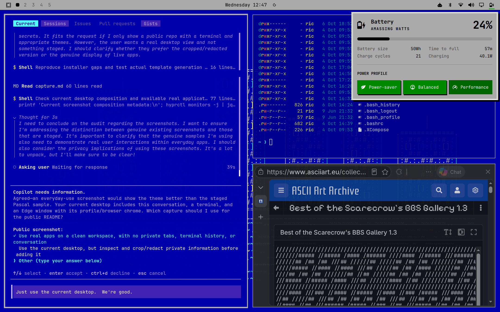
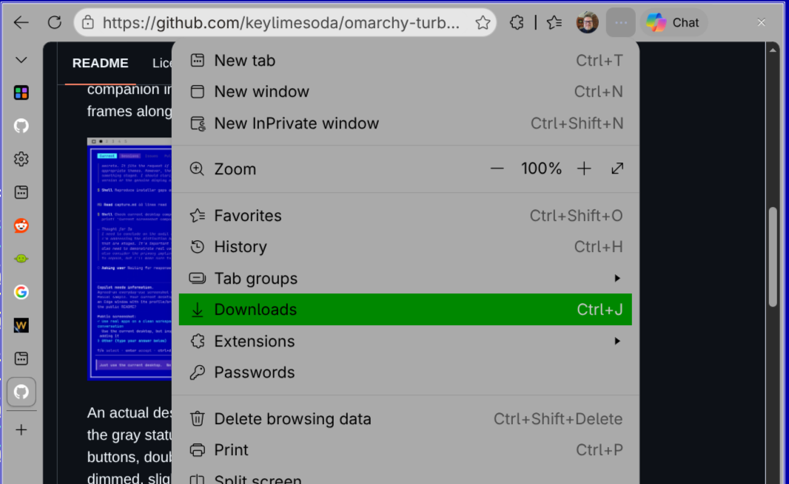
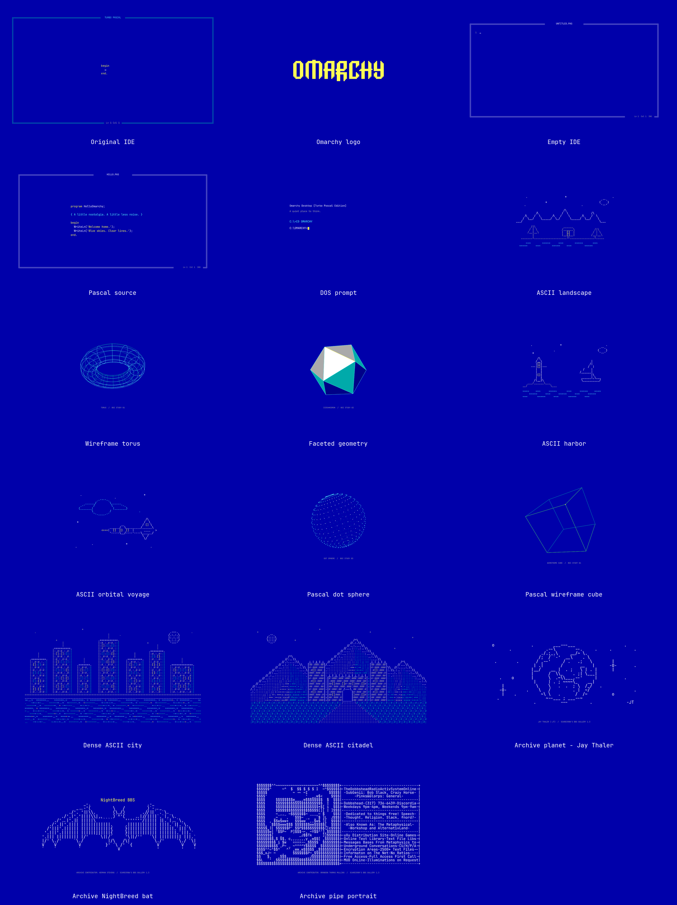

# Turbo Pascal Theme for Omarchy

An Omarchy theme inspired by Turbo Pascal's DOS IDE.

DOS-blue workspaces, gray dialogs, green buttons, and **double-white borders**.  Base colors in the theme, with a companion installer that brings the window and widget frames along for the ride.



An actual desktop in everyday use: DOS-blue terminals, the gray status bar and
battery panel, green power-profile buttons, double-white focused-window borders,
and dimmed, slightly transparent inactive windows.

## Install

**Theme:** colors, gray panels and seventeen wallpapers.

```bash
omarchy theme install https://github.com/keylimesoda/omarchy-turbo-pascal-theme.git
```

**Optional extras:** double borders, styled widgets, GTK3 app theming and focus fades.

```bash
cd ~/.config/omarchy/themes/turbo-pascal
./install.sh
```

Extras include hyprland config settings for window attention behavior, double-white borders, and custom base system widgets. Strives for easy compatibility, and will ask permission if install encounters potential incompatibilities.

Run without sudo.

## Uninstall extras

Run without sudo:

```bash
cd ~/.config/omarchy/themes/turbo-pascal
./uninstall.sh
```

This removes the extras and restores your previous shell and GTK theme settings.
**The base theme stays installed.**

## What's included

### Base theme

- Terminal and application palettes: DOS blue, white text, yellow emphasis and
  cyan directory names. Normal ANSI green appears yellow; widget buttons keep
  their own green fills.
- Gray bar, popup and menu colors, plus supported shell control colors/states.
- Gray browser tint where Omarchy's browser color policy is supported.
  Edge uses the optional GTK3 styling instead.
- Ordinary white focused-window borders and gray inactive-window borders.
- Seventeen static 4K wallpapers: IDE workspaces, Pascal source, a DOS prompt,
  text-mode scenery, mathematical geometry, and a DOS-colored Omarchy logo.
  No animations or additional wallpaper renderer.

Omarchy generates the application configs from `colors.toml` and
`shell.*.toml`. Custom widgets receive the colors they support, not an automatic
redesign.

### Optional extras

- **White / blue / white focused-window frames.** Inactive windows retain a
  single gray border.
- Double-white widget frames, black text on gray panels and crisp black shadows.
- Raised green buttons with white labels; selected buttons are darker and
  recessed.
- Styled menus with gray panels and green selections.
- **GTK3 app theming:** gray dialogs and toolbars, DOS-blue inputs and editors,
  cyan lists and cyan/blue scrollbars, white titles and frames, green buttons,
  black shadows, and sparse red error/destructive-action accents.
- 17% inactive dimming and a 97% compositor-opacity target for ordinary inactive
  windows, without another opacity multiplier. Application opt-outs, fullscreen
  windows, intrinsic transparency and later user rules are preserved.
- Gentle 275 ms ease-out fades for opacity and dimming, without bounce or
  desaturation. Other window and workspace animations keep Omarchy's defaults.
- Square corners for **Super+O** popped-out windows, overriding Omarchy's rounded
  pop-window rule while Turbo Pascal's native focus styling is active.



Edge in GTK appearance mode, with gray browser chrome and a green menu highlight.
Select **Settings → Appearance → Overall appearance → GTK** to use the app
colors. Website contents and GTK4/libadwaita apps are unchanged.

[Native GTK3 control preview](docs/gtk-apps.png)

## Optional extension

<details>
<summary>Extension details: requirements, files and removal</summary>

Install the theme first. The commands above add the optional extension.

**Tested baseline: Omarchy 4.0.4-1 and Hyprland 0.56.2.**
The installer also attempts compatible extras on Omarchy 4.x with Hyprland
0.52–0.56, using native Lua or legacy `.conf` output. Earlier-version syntax has
been checked against upstream source, not tested on those desktops. Double
borders have narrower compatibility than native focus effects.

| Option | Meaning |
|---|---|
| `--check` | Read-only prerequisite check; does not build or ask to replace widgets |
| `--allow-untested` | Try other versions; never bypass compositor/header ABI checks |
| `--skip-widgets` | Keep your existing widgets |
| `--skip-borders` | Omit the compiled window-border plugin |
| `--skip-focus` | Keep existing opacity, dimming, focus animations and popped-window corners |
| `--skip-gtk` | Keep existing GTK3 application and browser styling |

Pass options to `./install.sh`; they can be combined.

The extension activates the theme if necessary and restarts the shell.
It does not copy, overwrite or own the installed base theme. Do **not** use sudo.
It needs Python 3. Only double borders need Git, GNU make, g++, pkg-config and
matching development packages. A missing tool or failed border build does not
block widgets or focus effects. It never installs system packages or changes
`/usr/share/omarchy`.

The double border uses a small patch to the official
[`borders-plus-plus`](https://github.com/hyprwm/hyprland-plugins/tree/v0.56.0/borders-plus-plus)
plugin. The 0.56 source is pinned to upstream commit
`7644cecdb947060682891a0db2a0cdc5c0b9e704`; other versions attempt a matching
upstream tag. A patch/build failure skips double borders. The running
compositor commit and available ABI hash must match the installed headers and
dependencies; no precompiled plugin binary is distributed.

### What the installer changes

| Location | Purpose |
|---|---|
| `~/.config/omarchy/plugins/turbo-pascal.*/` | User-owned widget clones and shared styling library |
| `~/.config/omarchy/shell.json` | Switch existing supported widgets to those clones; keep the selected bar |
| `~/.config/omarchy/hooks/{theme-set,post-boot}.d/turbo-pascal-borders` | Theme-aware GTK3 styling, focus effects and border loading |
| `~/.local/share/omarchy-turbo-pascal/` | GTK selection helper, focus settings, border source, locally built plugin and runtime status |
| `~/.local/share/themes/omarchy-turbo-pascal/` | Optional GTK3 theme, selected only while Turbo Pascal is active |
| `~/.local/state/omarchy/turbo-pascal-install/` | Installation record and backups |

Existing widget positions, options, unrelated plugins, and idle settings are
preserved. Missing widget icons are not added; the menu service can still be
styled without an icon. Custom components are kept unless you approve replacing
them with stock-based styled clones. Their original files stay; their custom
behavior does not transfer. Existing target files require permission and are
backed up. Your transparent-bar setting is left alone.

The stock bar is themed through `shell.bar.toml`, not replaced. This preserves
third-party widgets' service access under the stock bar, including Sandman and
OmaSettings. A bar you selected yourself is also left unchanged. The
`turbo-pascal.bar/DosUi/` directory is only a shared widget styling library;
the installer does not copy its bar engine or register a replacement bar.

GTK3 styling applies to GTK3 apps as well as browsers using GTK appearance.
It imports the installed Adwaita-dark base, adding Turbo Pascal colors and
controls without overwriting existing GTK stylesheets. System light/dark mode
is unchanged. Existing files at our GTK theme path cause that extra to be
skipped. Switching themes removes our GTK selection; uninstall restores the
previous selection and removes our GTK theme files. Later manual GTK-theme
choices are preserved. Some apps may need reopening to pick up a theme change.
The control colors follow the
[Turbo Pascal screenshot references](https://ilyabirman.net/meanwhile/all/ui-museum-turbo-pascal-7-1/),
with the existing theme's darker green/white-label button treatment retained.
Red accents mark errors and destructive actions, rather than individual menu
mnemonic letters, which GTK CSS cannot reliably target.

An existing `borders-plus-plus` installation skips our window borders, not the
other extras. Conflicting hooks/runtime files and symlinked installation targets
stop installation rather than being overwritten.

Omarchy intentionally omits executable Lua from themes installed through Git.
The explicitly authorized companion hook appends only enabled native effects
to the generated theme; it preserves Omarchy's base output. Focus effects do not
need the compiled border plugin. Switching away removes the native overlay and
unloads only this installation's border plugin; shell clones remain installed
and fall back to the next theme's normal palette.

### Removal and updates

Uninstall restores shell and GTK theme settings and removes the owned plugins,
GTK theme, hooks and border runtime. The base theme stays installed; if it is active, Omarchy
reapplies its standard appearance. Later bar-layout and widget-option edits are
kept. Previously selected custom components are restored when still applicable.

Edited extension/plugin files stop removal before more files are removed;
back up your edits and restore the installed files first. Backups are retained.
If removal fails, fix the reported problem and run `./uninstall.sh` again.
For an update, uninstall, pull the repository, then install again; the previous
backup record is archived automatically.

If an older extras install selected `turbo-pascal.bar`, follow that update
sequence to restore your previous bar and install the widget-only enhancements.

Older companion installations also managed base-theme files; their saved
installation records retain the original restore behavior. Uninstall those
before installing the base theme through the standard Omarchy command.

After compositor upgrades, borders rebuild only when headers/dependencies
match; build/load failures are reported and skipped. See
`~/.local/share/omarchy-turbo-pascal/runtime-status.json` for native-effect
status. Shell clones are snapshots and do not automatically track upstream
changes. Tests use isolated fixtures; a clean-machine installation and actual
reboot persistence have not yet been verified.

The 97% target applies only to inactive, non-fullscreen windows carrying
Omarchy's `default-opacity` tag. It preserves application opt-outs and does not
eliminate transparency drawn inside an application. Excessive transparency on
the other machine remains undiagnosed. Neither installation configures Copilot
CLI, changes your font, or modifies your terminal command.

</details>

## Development

```bash
python3 -m unittest discover -s tests -v
bash -n install.sh uninstall.sh extras/borders/apply-borders \
  extras/borders/turbo-pascal-borders
```

Installer tests use a temporary home and simulated desktop commands; they do
not alter a running desktop. The plugin patch must also be built against the
supported Hyprland headers before releasing changes.

## Wallpapers



| File | Design |
|---|---|
| [0-dos-blue.png](backgrounds/0-dos-blue.png) | Original blue IDE workspace with a subtle frame and Pascal text |
| [1-omarchy.png](backgrounds/1-omarchy.png) | Official pixel-style Omarchy wordmark in yellow on DOS blue |
| [2-empty-ide.png](backgrounds/2-empty-ide.png) | Empty editor, double-white frame, and a tiny waiting cursor |
| [3-pascal-source.png](backgrounds/3-pascal-source.png) | Original Pascal program with yellow syntax and cyan comments |
| [4-dos-prompt.png](backgrounds/4-dos-prompt.png) | Quiet DOS prompt with a static yellow block cursor |
| [5-text-landscape.png](backgrounds/5-text-landscape.png) | Original ASCII mountains, moon, cabin, trees, and water |
| [6-wireframe-torus.png](backgrounds/6-wireframe-torus.png) | Cyan mathematical wireframe with a tiny yellow marker |
| [7-faceted-geometry.png](backgrounds/7-faceted-geometry.png) | Flat-shaded icosahedron with cyan edges and a yellow accent |
| [8-ascii-harbor.png](backgrounds/8-ascii-harbor.png) | Original moonlit ASCII harbor, lighthouse, and sailboat |
| [9-ascii-orbit.png](backgrounds/9-ascii-orbit.png) | Original ASCII ringed planet and starship with yellow windows |
| [10-dot-sphere.png](backgrounds/10-dot-sphere.png) | Depth-colored dotted sphere inspired by Pascal graphics demos |
| [11-wireframe-cube.png](backgrounds/11-wireframe-cube.png) | Green-and-teal perspective cube with a yellow corner marker |
| [12-ascii-city.png](backgrounds/12-ascii-city.png) | Dense ASCII waterfront skyline, textured buildings, and yellow window reflections |
| [13-ascii-citadel.png](backgrounds/13-ascii-citadel.png) | Dense ASCII mountain citadel with shaded peaks, brick towers, and a winding approach |
| [14-bbs-planet.png](backgrounds/14-bbs-planet.png) | Jay Thaler's signed planet illustration from Scarecrow's 1994 BBS archive |
| [15-bbs-bat.png](backgrounds/15-bbs-bat.png) | NightBreed bat-wing artwork from the archive, contributed by Herman Stevens |
| [16-bbs-pipe-portrait.png](backgrounds/16-bbs-pipe-portrait.png) | User-supplied ASCII pipe portrait and original BBS panel, with archive contributor credit |

All backgrounds are 3840x2160 PNGs with a shared DOS-blue background. Cycle
through the installed collection with:

```bash
omarchy theme bg next
```

The geometry designs are original mathematical illustrations inspired by the
look of DOS graphics demos, not copied screenshots or official Borland artwork.
The landscape, harbor, orbital scene, city, and citadel are original ASCII art.
The city and citadel use filled 108-column, 36-row character scenes for a denser
BBS-style alternative to the quieter outline designs.
All designs are static: even the cursors are painted pixels, not blinking animations.
The dotted sphere and wireframe cube take visual inspiration from the modern
[Turbo Pascal demo collection](https://github.com/johangardhage/dos-tpdemos);
the wallpaper geometry is generated here rather than copied from its screenshots.

Editable SVG sources for the original designs live in `artwork/`.
Regenerate the twelve newer original designs and three archive selections with
Python 3 and `rsvg-convert`
(the librsvg rendering tool):

```bash
python3 artwork/generate.py
```

This rewrites their generated SVG and PNG files; make source changes in the
generator if you want them to survive regeneration. Rendering uses the
Omarchy-installed JetBrains Mono Nerd Font, with a monospace fallback. Exact
glyph appearance can differ on machines without that font. The three archive
designs use their preserved `.txt` sources rather than generated character art.

The logo wallpaper is recolored from Omarchy's
[`matte-black/backgrounds/omarchy.png`](https://github.com/basecamp/omarchy/blob/master/themes/matte-black/backgrounds/omarchy.png),
under the upstream MIT license included below. Its original 3840x2160 geometry
is unchanged. To reproduce it on the supported Omarchy baseline with ImageMagick:

```bash
magick /usr/share/omarchy/themes/matte-black/backgrounds/omarchy.png \
  -fill '#0000AA' -opaque '#121212' \
  -fill '#FFFF55' -opaque '#E68E0D' -strip backgrounds/1-omarchy.png
```

## Credits and license

Original theme artwork and adaptations: [keylimesoda](https://github.com/keylimesoda),
MIT licensed, **except for the three separately documented BBS archive wallpapers**.
The planet, NightBreed bat, and pipe portrait appear in
[Best of the Scarecrow's BBS Gallery 1.3](https://www.asciiart.eu/collections/best-of-the-scarecrows-bbs-gallery-1-3),
compiled by Glen Robbins in 1994. Their original text and available credits
are preserved; see [`licenses/scarecrow-bbs-NOTICE.txt`](licenses/scarecrow-bbs-NOTICE.txt)
for the archive's no-charge, non-commercial distribution notice. Do not assume
these assets have the commercial reuse permissions of MIT. The archive does
not establish the original artist of every piece.
The pipe portrait uses the exact text supplied by the user. The underlying
Dobbshead image has a [rights notice from the SubGenius Foundation](https://www.subgenius.com/trademark.htm);
the archive's general statement does not settle those rights.

Shell clones are adapted from Omarchy 4.0.4 and retain Omarchy's
MIT license in [`licenses/omarchy-MIT.txt`](licenses/omarchy-MIT.txt).
The Hyprland plugin is BSD-3-Clause; its notice is included in
[`licenses/hyprland-plugins-BSD-3-Clause.txt`](licenses/hyprland-plugins-BSD-3-Clause.txt).

Turbo Pascal is referenced as visual inspiration. This project is not
affiliated with or endorsed by Borland, Embarcadero, Omarchy, or Hyprland.
The IDE, source, prompt, landscape, and geometry wallpapers are original
artwork, not copies of historical screenshots. The three BBS archive selections
are credited third-party artwork under the separate notice above.
The Omarchy logo wallpaper adapts the upstream artwork as described above.
