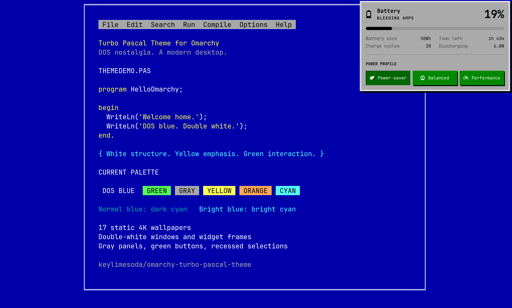
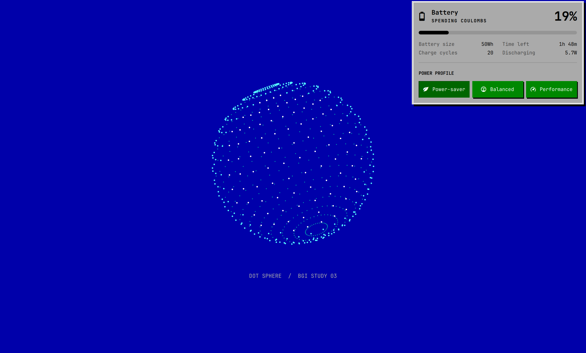

# Turbo Pascal Theme for Omarchy

DOS-blue workspaces, gray dialogs, green buttons, and **double-white borders**.
An Omarchy theme inspired by Turbo Pascal's DOS IDE, with an optional companion
installer that brings the window and widget frames along for the ride.



The terminal preview uses illustrative Pascal text and the theme's actual ANSI
palette.

## What's included

- A deep DOS-blue terminal, white text, yellow emphasis, and readable cyan
  directory names. ANSI blue is mapped to dark cyan (`#00AAAA`), while bright
  blue stays bright cyan (`#55FFFF`). ANSI green
  becomes bright yellow (`#FFFF55`) for the Omarchy terminal logo and update
  headings, while bright green stays green (`#55FF55`). ANSI yellow remains
  yellow, and bright yellow becomes bright orange (`#FFAA55`). Other normal
  green-coded terminal output also shifts to yellow; widget buttons keep their
  independently configured green fills.
- Gray widget panels with black text, double-white frames, and crisp black
  drop-shadows.
- Green buttons with white labels. Selected buttons are darker and recessed;
  unselected buttons have a small offset shadow.
- Gray menus with green selections and a green open-widget indicator.
- **Focused windows framed by white / blue / white lines.** Inactive windows
  retain a single gray border.
- A subtle fade and 17% dimming for unfocused windows. Compositor inactive
  opacity is `0.97`, combined with Omarchy's existing application-specific
  opacity. Focused windows keep their normal appearance. This uses transparency
  and dimming, not a desaturation filter.
- Gentle 275 ms ease-out focus transitions for both opacity and dimming:
  an immediate response followed by soft, analog-inspired settling, without bounce.
  Other window and workspace animations retain Omarchy's defaults.
- Seventeen static 4K wallpapers: IDE workspaces, Pascal source, a DOS prompt,
  text-mode scenery, mathematical geometry, and a DOS-colored Omarchy logo.
  No animations or additional wallpaper renderer.

The frame styling, inactive-window fade, and widget enhancements require the
companion installer. The palette works on its own.



## Full experience

**Supported baseline: Omarchy 4.0.4 (tested with package 4.0.4-1), its Lua
Hyprland configuration, and Hyprland 0.56.2 with matching development headers.**
Other versions are deliberately rejected until the code has been checked
against them. This is a first release, not a universal Hyprland plugin bundle.

Review the scripts, then run these commands as your desktop user inside your
running Hyprland session:

```bash
git clone https://github.com/keylimesoda/omarchy-turbo-pascal-theme.git
cd omarchy-turbo-pascal-theme
./install.sh --check
./install.sh
```

The installer activates the theme and restarts the shell. Do **not** use sudo.
It needs Python 3, Git, GNU make, g++, pkg-config, jq, and the development
packages reported by its prerequisite check. It never installs system packages
or changes `/usr/share/omarchy`.

The double border uses a small patch to the official
[`borders-plus-plus`](https://github.com/hyprwm/hyprland-plugins/tree/v0.56.0/borders-plus-plus)
plugin, pinned to upstream commit
`7644cecdb947060682891a0db2a0cdc5c0b9e704`. It is built locally against your
installed headers; no precompiled plugin binary is distributed.

### What the installer changes

| Location | Purpose |
|---|---|
| `~/.config/omarchy/themes/turbo-pascal/` | Theme palette and wallpaper |
| `~/.config/omarchy/plugins/turbo-pascal.*/` | User-owned shell clones |
| `~/.config/omarchy/shell.json` | Switch the built-in bar and existing supported widgets to those clones |
| `~/.config/omarchy/hooks/{theme-set,post-boot}.d/turbo-pascal-borders` | Theme-aware border loading |
| `~/.local/share/omarchy-turbo-pascal/` | Border source, locally built plugin, and runtime script |
| `~/.local/state/omarchy/turbo-pascal-install/` | Installation record and backups |

Existing widget positions, options, unrelated plugins, and idle settings are
preserved. Missing widgets are not added. Active custom bars or custom clones
of affected widgets are rejected rather than overwritten. Existing
`borders-plus-plus` installations, conflicting hooks, and symlinked installation
targets are also rejected.

Omarchy intentionally omits executable Lua from themes installed through Git.
The explicitly authorized companion hook supplies this theme's border Lua to
the generated theme at activation. Switching away unloads this installation's
border plugin; the shell clones remain installed and fall back to the next
theme's normal palette.

### Uninstall and updates

```bash
./uninstall.sh
```

Uninstall restores backed-up theme files and shell settings, removes the owned
plugins and hooks, and restores the previous theme if Turbo Pascal is still
active. If you changed the bar layout after installation, the clones are
swapped back without discarding your new layout or widget options.

Edited theme/plugin/runtime files stop uninstall **before anything is removed**;
back up your edits and restore the installed files first. Backups are retained.
For an update, uninstall, pull the repository, then install again; the previous
backup record is archived automatically.

On unsupported Hyprland upgrades the border hook reports an error instead of
loading an incompatible binary. Rebuilding is automatic only on the supported
baseline. Shell clones are snapshots, so upstream shell changes do not
automatically update them. Installer/hook lifecycle checks use isolated
fixtures; a clean-machine installation and actual reboot persistence have not
yet been verified.

## Palette only

For the colors and wallpaper without installing executable companion code:

```bash
omarchy theme install https://github.com/keylimesoda/omarchy-turbo-pascal-theme.git
```

This does **not** install the double-line window/widget frames, inset button
styling, or custom shadows. It also does not configure Copilot CLI, change your
font, or modify your terminal command.

## Development

```bash
python3 -m unittest discover -s tests -v
bash -n install.sh uninstall.sh extras/borders/apply-borders \
  extras/borders/turbo-pascal-borders
```

Installer tests use a temporary home and simulated desktop commands; they do
not alter a running desktop. The plugin patch must also be built against the
supported Hyprland headers before releasing changes.

## Wallpapers


| File | Design |
|---|---|
| [0-dos-blue.png](backgrounds/0-dos-blue.png) | Original blue IDE workspace with a subtle frame and Pascal text |
| [1-omarchy.png](backgrounds/1-omarchy.png) | Official pixel-style Omarchy wordmark in yellow on DOS blue |
| [2-empty-ide.png](backgrounds/2-empty-ide.png) | Empty editor, double-white frame, and a tiny waiting cursor |
| [3-pascal-source.png](backgrounds/3-pascal-source.png) | Original Pascal program with yellow syntax and cyan comments |
| [4-dos-prompt.png](backgrounds/4-dos-prompt.png) | Quiet DOS prompt with a static yellow block cursor |
| [5-text-landscape.png](backgrounds/5-text-landscape.png) | Original ASCII mountains, moon, cabin, trees, and water |
| [6-wireframe-torus.png](backgrounds/6-wireframe-torus.png) | Cyan mathematical wireframe with a tiny yellow marker |
| [7-faceted-geometry.png](backgrounds/7-faceted-geometry.png) | Flat-shaded icosahedron with cyan edges and a yellow accent |
| [8-ascii-harbor.png](backgrounds/8-ascii-harbor.png) | Original moonlit ASCII harbor, lighthouse, and sailboat |
| [9-ascii-orbit.png](backgrounds/9-ascii-orbit.png) | Original ASCII ringed planet and starship with yellow windows |
| [10-dot-sphere.png](backgrounds/10-dot-sphere.png) | Depth-colored dotted sphere inspired by Pascal graphics demos |
| [11-wireframe-cube.png](backgrounds/11-wireframe-cube.png) | Green-and-teal perspective cube with a yellow corner marker |
| [12-ascii-city.png](backgrounds/12-ascii-city.png) | Dense ASCII waterfront skyline, textured buildings, and yellow window reflections |
| [13-ascii-citadel.png](backgrounds/13-ascii-citadel.png) | Dense ASCII mountain citadel with shaded peaks, brick towers, and a winding approach |
| [14-bbs-planet.png](backgrounds/14-bbs-planet.png) | Jay Thaler's signed planet illustration from Scarecrow's 1994 BBS archive |
| [15-bbs-bat.png](backgrounds/15-bbs-bat.png) | NightBreed bat-wing artwork from the archive, contributed by Herman Stevens |
| [16-bbs-pipe-portrait.png](backgrounds/16-bbs-pipe-portrait.png) | User-supplied ASCII pipe portrait and original BBS panel, with archive contributor credit |

All backgrounds are 3840x2160 PNGs with a shared DOS-blue background. Cycle
through the installed collection with:

```bash
omarchy theme bg next
```

The geometry designs are original mathematical illustrations inspired by the
look of DOS graphics demos, not copied screenshots or official Borland artwork.
The landscape, harbor, orbital scene, city, and citadel are original ASCII art.
The city and citadel use filled 108-column, 36-row character scenes for a denser
BBS-style alternative to the quieter outline designs.
All designs are static: even the cursors are painted pixels, not blinking animations.
The dotted sphere and wireframe cube take visual inspiration from the modern
[Turbo Pascal demo collection](https://github.com/johangardhage/dos-tpdemos);
the wallpaper geometry is generated here rather than copied from its screenshots.

Editable SVG sources for the original designs live in `artwork/`.
Regenerate the twelve newer original designs and three archive selections with
Python 3 and `rsvg-convert`
(the librsvg rendering tool):

```bash
python3 artwork/generate.py
```

This rewrites their generated SVG and PNG files; make source changes in the
generator if you want them to survive regeneration. Rendering uses the
Omarchy-installed JetBrains Mono Nerd Font, with a monospace fallback. Exact
glyph appearance can differ on machines without that font. The three archive
designs use their preserved `.txt` sources rather than generated character art.

The logo wallpaper is recolored from Omarchy's
[`matte-black/backgrounds/omarchy.png`](https://github.com/basecamp/omarchy/blob/master/themes/matte-black/backgrounds/omarchy.png),
under the upstream MIT license included below. Its original 3840x2160 geometry
is unchanged. To reproduce it on the supported Omarchy baseline with ImageMagick:

```bash
magick /usr/share/omarchy/themes/matte-black/backgrounds/omarchy.png \
  -fill '#0000AA' -opaque '#121212' \
  -fill '#FFFF55' -opaque '#E68E0D' -strip backgrounds/1-omarchy.png
```

## Credits and license

Original theme artwork and adaptations: [keylimesoda](https://github.com/keylimesoda),
MIT licensed, **except for the three separately documented BBS archive wallpapers**.
The planet, NightBreed bat, and pipe portrait appear in
[Best of the Scarecrow's BBS Gallery 1.3](https://www.asciiart.eu/collections/best-of-the-scarecrows-bbs-gallery-1-3),
compiled by Glen Robbins in 1994. Their original text and available credits
are preserved; see [`licenses/scarecrow-bbs-NOTICE.txt`](licenses/scarecrow-bbs-NOTICE.txt)
for the archive's no-charge, non-commercial distribution notice. Do not assume
these assets have the commercial reuse permissions of MIT. The archive does
not establish the original artist of every piece.
The pipe portrait uses the exact text supplied by the user. The underlying
Dobbshead image has a [rights notice from the SubGenius Foundation](https://www.subgenius.com/trademark.htm);
the archive's general statement does not settle those rights.

Shell clones are adapted from Omarchy 4.0.4 and retain Omarchy's
MIT license in [`licenses/omarchy-MIT.txt`](licenses/omarchy-MIT.txt).
The Hyprland plugin is BSD-3-Clause; its notice is included in
[`licenses/hyprland-plugins-BSD-3-Clause.txt`](licenses/hyprland-plugins-BSD-3-Clause.txt).

Turbo Pascal is referenced as visual inspiration. This project is not
affiliated with or endorsed by Borland, Embarcadero, Omarchy, or Hyprland.
The IDE, source, prompt, landscape, and geometry wallpapers are original
artwork, not copies of historical screenshots. The three BBS archive selections
are credited third-party artwork under the separate notice above.
The Omarchy logo wallpaper adapts the upstream artwork as described above.
